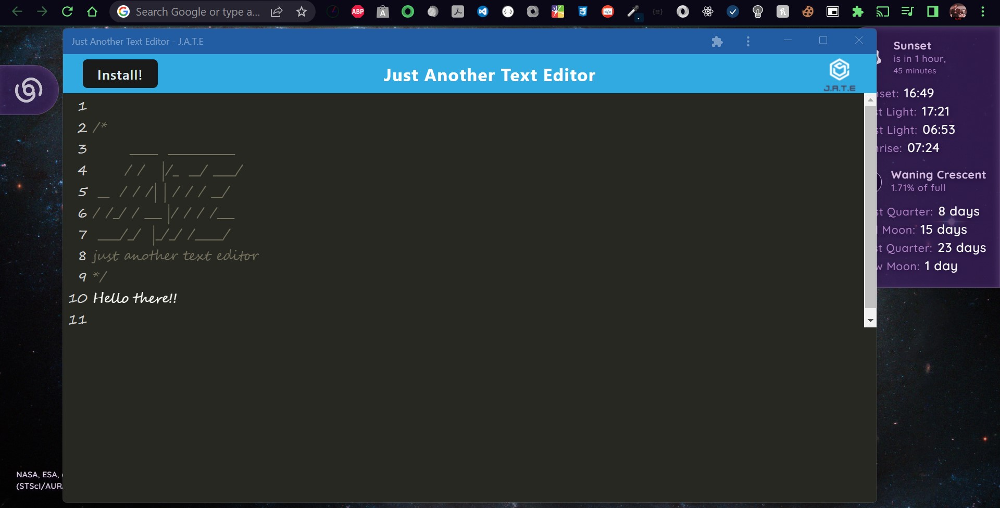
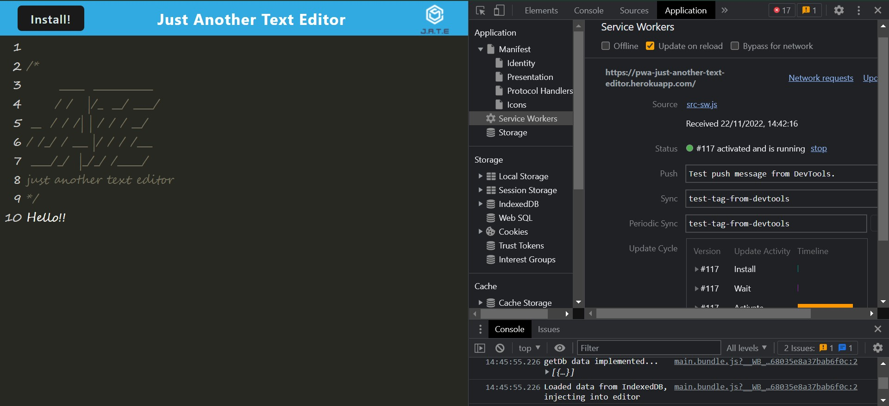
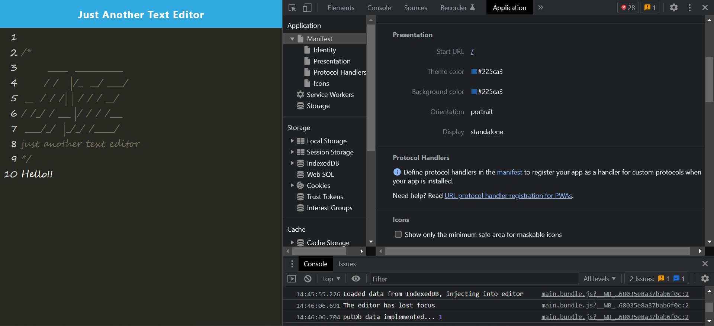
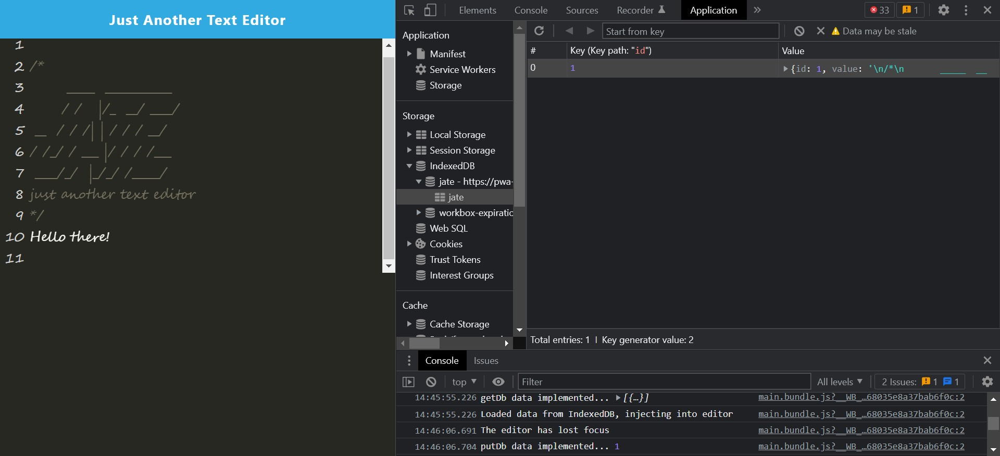

# 
 🏷️**Just Another Text Editor(J.A.T.E) - PWA** 

---

## 
 _Description_ 📝

A single-page application(text editor) that runs in a browser, meets the PWA(progressive web applications) and features a number of data persistence techniques that serve as redundencies in case one of the options is not supported by the browser.

## 
 _Languages Used_ 💬

Javascript, Node.js, IndexedDB

---

## _Table of Contents📖_

- [Installation](#Installation)💾
- [Usage](#Usage)🖥️
- [Links](#Links)📎
- [Credits](#Credits)💳
- [Licence](#License)🪪
- [Badges](#Badges)🦡
- [Questions](#Questions)❓
- [Contribution](#Contribution)➕
- [Tests](#Tests)🧪

---

## _Installation💾_

1. Git clone the mentioned repo and unzip.
2. `npm i` to install all npm dependencies.
   1. `npm run start:dev` to build and run app.

## _Usage🖥️_

1. `npm run start` to run the app.
2. In browser, type `https://localhost:3001` _(or preferred port#)_, to view the app.

Or, simply proceed to the deployed application link mentioned to begin using...

## _Links📎_

Click for Github repo and deployed Links

- [J.A.T.E](https://github.com/A-N26/Text-Editor-JATE-pwa)

- [heroku](https://pwa-just-another-text-editor.herokuapp.com/)

## _Credits💳_

google/youtube & in-class sessions.

## _License🪪🦡_

(**Please Click the BADGE for the license details.**)

## _Badges🦡_

   

## _Questions❓_

If you would like to as me anything (ama) about the project, please contact me on the info mentioned below:

Contact Me✉️

- My GitHub Profile - [A-N26](https://github.com/A-N26)

- e-mail - [📧](A-N26@github.com)

## _Contribution➕_

Please do not hesitate to fork this repo. And, there-after, create a new branch and commit, push that branch and create a pull request.☻

## _Tests🧪_

N/A
